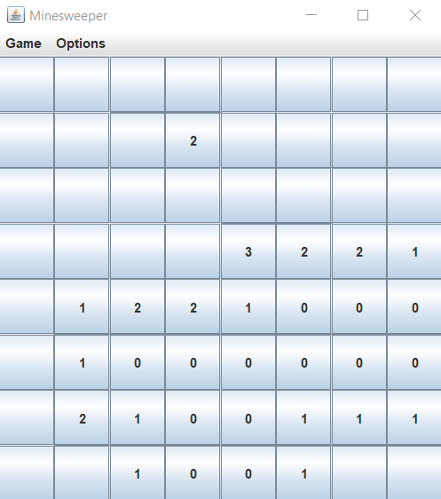

# Minesweeper Game



## Overview

This is a classic implementation of the Minesweeper game in Java with a graphical user interface (GUI) using Swing.

## Features

- **Game Field Representation:**
  - The game board is represented by the `GameField` class, which includes fields and mines.
  - Each field is represented by the `Field` class, storing information about whether it's open, contains a mine, or the number of adjacent mines.

- **Graphical User Interface (GUI):**
  - The GUI is implemented using Swing components.
  - Buttons in a grid layout represent the cells of the Minesweeper game board.

- **Game Initialization and Reset:**
  - The game initializes with a default size of 8x8 cells and 10 mines.
  - The `startNewGame` method initializes a new game with the specified number of rows, columns, and mines.

- **Button Actions:**
  - Each button on the game board has an associated ActionListener.
  - The `updateButtons` method updates the text on each button based on the game state.

- **Menu Options:**
  - The game provides menu options for starting a new game, changing the mine count, changing the board size, and exiting the game.
  - The mine count and board size can be adjusted through dialogs presented to the user.

- **Difficulty Levels:**
  - Three difficulty levels are available (easy, intermediate, and hard) with corresponding mine percentages.

- **Board Size Adjustment:**
  - The user can adjust the board size between 8x8 and 12x12 through the "Change Board Size" option in the menu.

## How to Run

1. Compile the Java files:

   ```bash
   javac MinesweeperGUI.java GameField.java Field.java

2. Create the JAR file:

   ```bash
   jar cfm Minesweeper.jar Manifest.txt MinesweeperGUI.class GameField.class Field.class bomb.wav

3. Run the game:

   ```bash
   java -jar Minesweeper.jar
